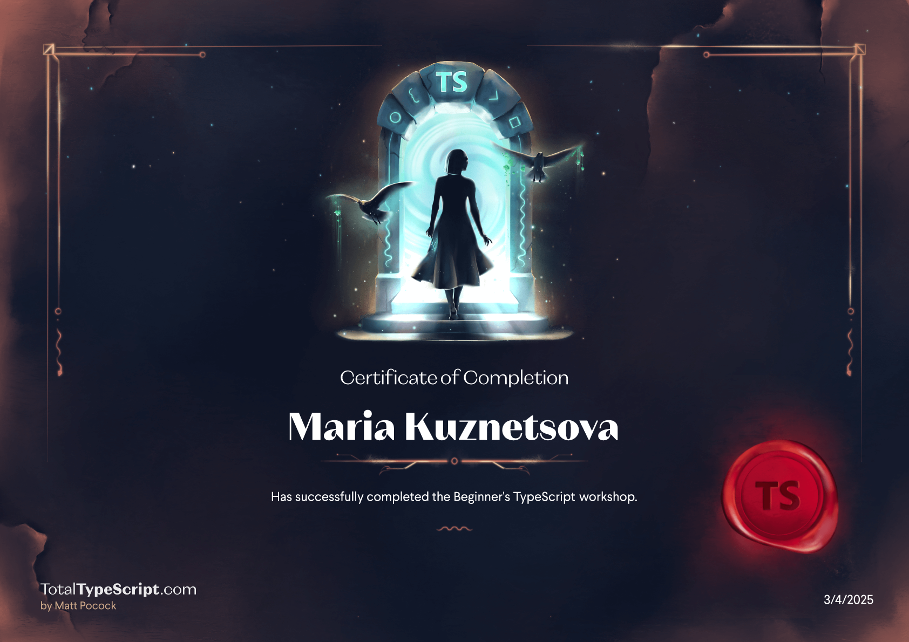
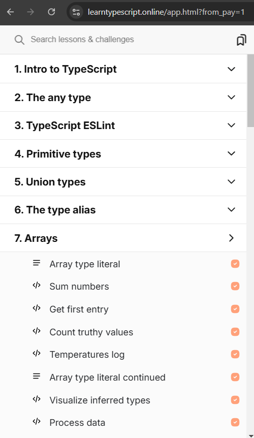
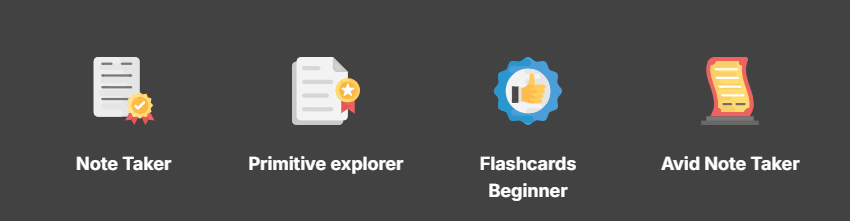

# My TypeScript Journey

## Course 'Beginner's TypeScript'

<b>Here is my result of the course: Passed</b>

### Result
I successfully completed the entire course and obtained a certificate.

### Main Topics Covered
- The Implicit ‘Any’ Type Error
- Working with Object Params
- Set Properties as Optional
- Optional Parameters
- Assigning Types to Variables
- Constraining Value Types
- Working with Arrays
- Function Return Type Annotations
- Typing Promises and Async Requests
- Passing Type Arguments
- Assigning Dynamic Keys to an Object
- Narrowing Down Union Types
- Typing Errors in a Try-Catch
- Inheriting Interface Properties
- Combining Types to Create New Types
- Selectively Construct Types from Other Types
- Typing Functions
- Typing Async Functions

### Feedback
The course is well-structured, covering essential TypeScript concepts with detailed explanations through theory and videos and it provides enough practice tasks. However, the system for running these tasks is inconvenient. Each problem runs in a remote environment directly on the site, requiring the terminal to download dependencies and run tests every time. This process is not very flexible and consumes significant system resources. Adding more interactive coding exercises or project-based tasks would improve the learning experience.

## Course 'Learn TypeScript step by step in an interactive environment'

<b>Here is my result of the course: Passed the free-trial part</b> 

### Result
I completed the free sections of the course (7 chapters). Unfortunately, the remaining parts require payment, which I was unable to proceed with.

### Main Topics Covered
- Intro to TypeScript
- The any type
- TypeScript ESLint
- Primitive types
- Union types
- The type alias
- Arrays

### Feedback
I enjoyed this course more because of its interactive approach, which made learning more engaging. However, I struggled with the navigation, as it was not always intuitive. The free portion of the course was useful, but I wish more content was accessible without payment. Overall, this course provided more practical experience, simplifying concepts with more practical, simple tasks step by step, starting from the easiest level.

## Reflections
Both courses contributed significantly to my understanding of TypeScript. The first course provided strong theoretical foundations, while the second one helped me apply concepts through interactive exercises. Moving forward, I plan to reinforce my knowledge by working on real-world projects and seeking additional practice. TypeScript is a valuable skill for front-end and full-stack development, and these courses have given me a great starting point.
